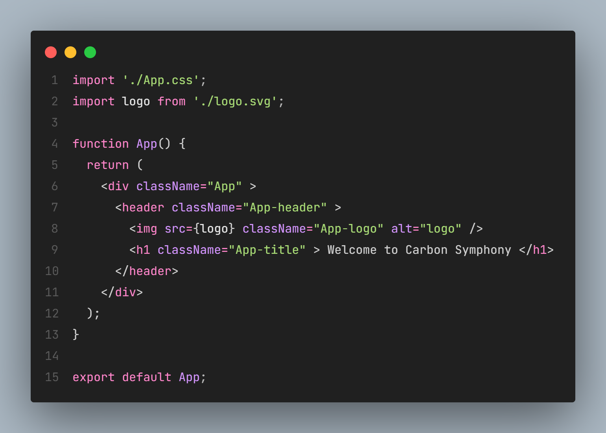
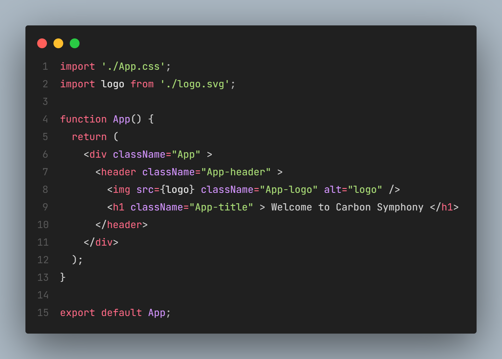
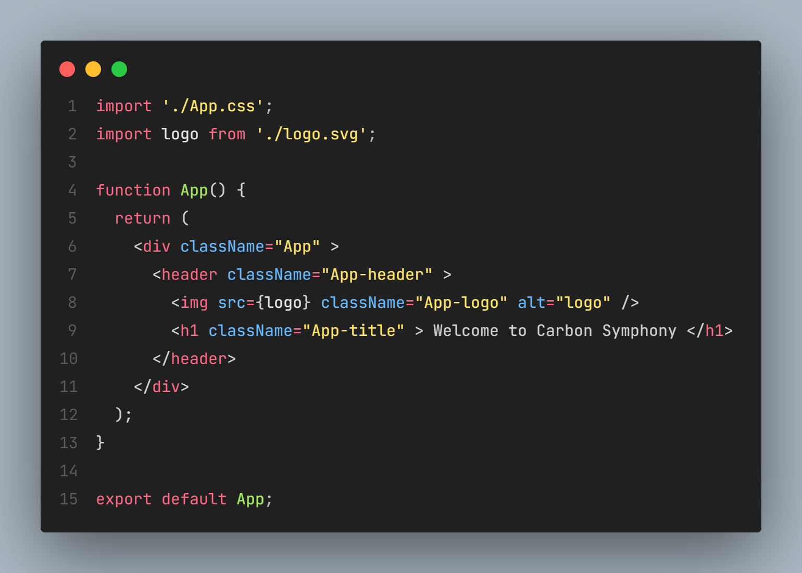

# Carbon Symphony

A collection of minimalist themes for VSCode

## Carbon Night

## Carbon Remix

## Carbon Symphony

## Carbon Nexus

# Install

1. Install theme from the [Marketplace](https://marketplace.visualstudio.com/items?itemName=JefersonFerreira.carbon-symphony)

2. Go to `File > Preferences > Theme > Color Theme` or `Press Ctrl+Shift+P`

3. Select `Carbon Nexus`, `Carbon Night`, `Carbon Remix` or `Carbon Symphony`

# License
[MIT License](./LICENSE)